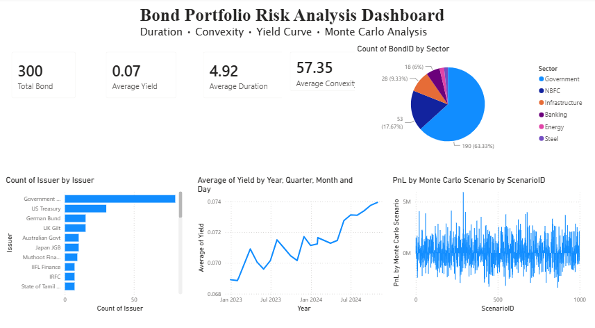

# Bond Portfolio Risk Analysis AI Agent

## Project Overview

This project performs Bond Portfolio Risk Analysis using Python, Machine Learning, Monte Carlo Simulation and Microsoft Power BI.

The objective is to analyze bond portfolio risk based on duration, convexity, yield curve movements and market scenarios.

---

## Features

- Bond Portfolio Analysis
- Yield Curve Analysis
- Monte Carlo Simulation
- AI Bond Recommendation Engine
- Random Forest Model
- XGBoost Model
- Neural Network Model
- Power BI Dashboard
- Risk Reports Generation

---

## Technologies Used

- Python
- Pandas
- NumPy
- Matplotlib
- Scikit-Learn
- XGBoost
- Microsoft Power BI
- Git
- GitHub

---

## Folder Structure

Project_Convexity_AI_Agent

│

├── Data

├── Images

├── Python

├── PowerBI

├── Report

├── README.md

└── requirements.txt

---

## Outputs

- Top Bond Issuers
- Yield Distribution
- Duration Distribution
- Convexity Distribution
- Monte Carlo Distribution
- AI Bond Recommendation
- Yield Curve Analysis

---

## Machine Learning Models

- Random Forest
- XGBoost
- Neural Network (MLP)

---

## Dashboard
## Dashboard Preview

The dashboard contains:
- Total Bonds
- Average Yield
- Average Duration
- Average Convexity
- Bond Issuer Analysis
- Yield Trend
- Monte Carlo Risk Analysis

---

## Future Improvements

- Streamlit Web App
- SHAP Explainability
- LSTM Yield Prediction
- Live Financial API Integration

---

## Author

Aditya Vishwakarma
